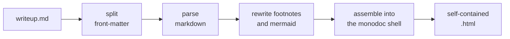

<span class="newthought">A writeup is plain markdown</span> with a little structure around it. This document is itself a writeup — read its source beside its rendering and the whole contract is visible at once.[^vanilla]

The renderer does almost nothing, and that is the design. Vanilla Markdown carries the prose; a thin transform layer rewrites only the two things Markdown cannot express on its own — footnotes and diagrams — and everything else passes straight through.

## The pipeline

The path from a `.md` file to a finished page is short:



Each stage is a few dozen lines. The renderer reads the monodoc shell, inlines the theme, swaps the article body, and writes one file.[^shell]

<p class="pull-quote">The renderer stays thin so the document stays plain. Every primitive the renderer does not know about is one the author can still use.</p>

## What survives the transform

Three kinds of content reach the page:

- **Standard markdown** — headings, prose, lists, code, quotes, tables, images. Parsed and rendered conventionally.
- **Footnotes** — written `[^name]` in the text, defined anywhere, rewritten into monodoc's sidenote primitive.
- **Raw HTML** — custom figures, pull quotes, the small-caps lead-in that opened this document. The author writes the HTML; the renderer leaves it alone.

A plain blockquote, for contrast with the pull quote above — Edward Tufte, on choosing a typeface:

> There are too many substantive matters to think about. I let it go at that.

Images are ordinary markdown; the browser fetches them at view time, whether the source is a local path or a remote URL:


And a code block, rendered in the monospace family:

```rust
fn main() {
    println!("a writeup is just a file");
}
```

That is the whole form. Nothing here needs a build step more elaborate than one command.[^command]

[^vanilla]: "Vanilla" is load-bearing. No custom markdown dialect — standard syntax plus HTML escape hatches. A custom dialect would lock the content into this one renderer; plain markdown keeps it portable.

[^shell]: The shell is the bundled `kernel/demo.html`. Reading it live means the renderer always reflects the current state of the typographic kernel — there is no copied template to drift out of sync.

[^command]: `lyceum render writeup.md`. That is the entire invocation.
